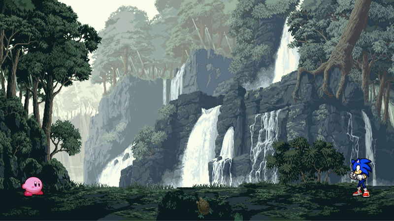
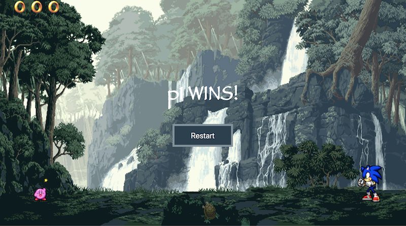

# The Events Workshop

## Exercise 5 - The Big Bad Showdown

### Instructions

Here are screenshots of the game you have to reproduce.

You can find additional screenshots in the screenshots folder.

These are the features to implement:

1. Menu
2. Random position signal with sound (the exclamation marks)
3. Getting a point (first player to press their key wins, adds a point to the player)
4. Lose round (Opponent wins point)
5. Scores (display scores at the top for each player)
6. 3 rounds to win
7. Winning screen with restart button

Optional

- Implement the sounds
- Run animation
- Move player to prize when round is won
